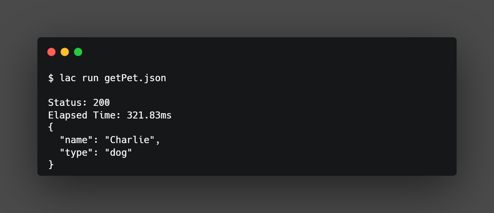

# Gorcli

`gorcli` a cli only API client. It can be used for API exploration and testing.



## Installation

### Install with Go

```sh
go install github.com/eynopv/gorcli@latest
```

## Usage

```sh
gorcli [command]
```

Read [manual](docs/Manual.md)

## License

This project is licensed under the BSD 3-Clause License.
